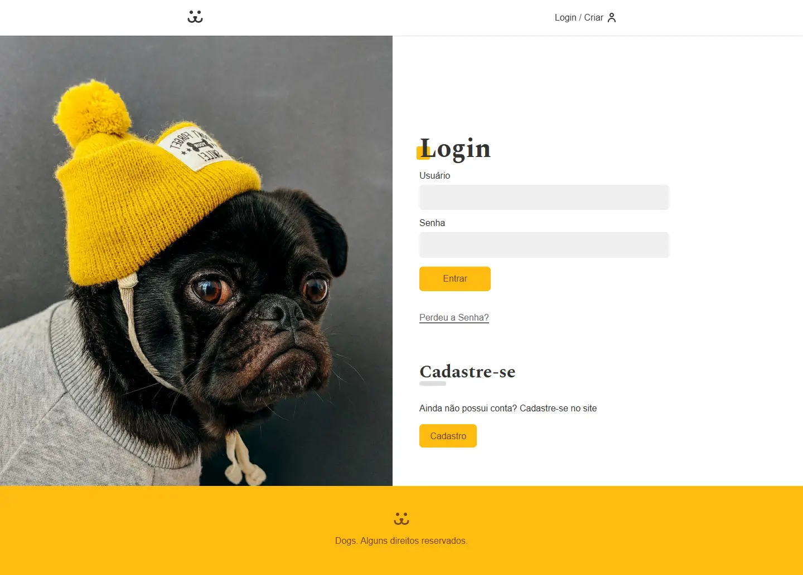
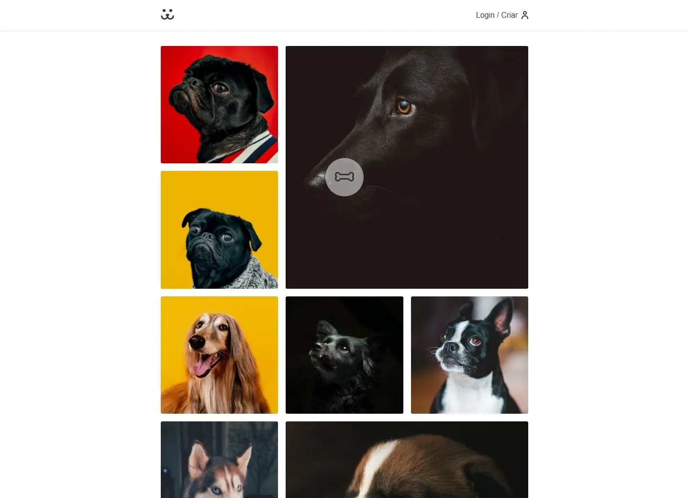
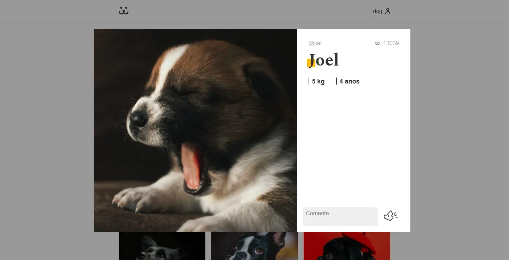

# ORIGAMID - React Completo

[]()
[]()



> Projeto desenvolvido durante o curso React Completo da Origamid

## 🔗 Links

- **Demo ao vivo:** [https://alvarenga-frontend-dogs-origamid.pages.dev/](https://alvarenga-frontend-dogs-origamid.pages.dev/)
- **Curso:** [Origamid - React Completo](https://www.origamid.com)

---

## 📋 Sobre

Projeto completo desenvolvido como exercício final do curso **React Completo** da [Origamid](https://origamid.com).

O objetivo era praticar e consolidar conhecimentos de React, criando um site profissional e responsivo do zero.

---

## 🎯 Objetivos de Aprendizado

- ✅ Dominar HTML, CSS, Javascript e, principalmente, React
- ✅ Praticar type module, babel, eslint
- ✅ Criar layout responsivo completo
- ✅ Trabalhar com interações React

---

## ✨ Características

### Layout & Design

- Criar aplicação SPA com React
- Trabalhar com componentes reutilizáveis
- Gerenciar estado com Hooks
- Consumir API REST
- Implementar autenticação JWT
- Trabalhar com rotas (React Router)
- Organização de código escalável

### Funcionalidades

- Sistema de Login / Logout
- Cadastro de usuário
- Upload de fotos
- Curtidas
- Comentários
- Estatísticas do perfil
- Consumo de API externa

---

## 🛠️ Tecnologias

- **React** - Biblioteca principal
- **React Router DOM** - Gerenciamento de rotas
- **JavaScript (ES6+)**
- **CSS Modules**
- **Fetch API**
- **Git & GitHub**
- **Biblioteca externa (Victory)**


---

## 📁 Estrutura do Projeto

```
dogs/
├── public/
│   └── icones
│   ├── manifest.json
│
├── src/
│   ├── Assets/          # Ícones, imagens
│   ├── Components/      # Componentes reutilizáveis
│   ├── Hooks/           # Hooks customizados
│   ├── api.js
│   ├── App.jsx
│   ├── main.jsx
│   └── UserContext.jsx
│
├── index.html
├── package.json
└── README.md
```

## 📸 Screenshots

### Perfis



### Login


### Comentários



---

## 📚 O que Aprendi

- Componentização avançada no React
- Padrões de organização de aplicações
- Context API
- Hooks customizados
- Boas práticas de performance
- Autenticação e proteção de rotas
- Integração com backend (básico)

---

## 🎓 Certificado

Este projeto faz parte do curso **React Completo** da Origamid.

[](https://www.origamid.com/certificate/4d5f5e88)

---

## 👤 Autor

**Rodrigo Alvarenga**  
_Desenvolvedor Frontend & UI Designer_

[](mailto:alvarenga.frontend@gmail.com)
[](https://github.com/alvarenga-codes)

---

## 📖 Sobre a Origamid

A [Origamid](https://origamid.com) é uma plataforma de cursos online focada em design e desenvolvimento web, reconhecida pela qualidade técnica e didática dos seus conteúdos.

---

<div align="center">

**Se este projeto te ajudou, considere dar uma ⭐**

Desenvolvido durante curso Origamid | 2026

</div>
